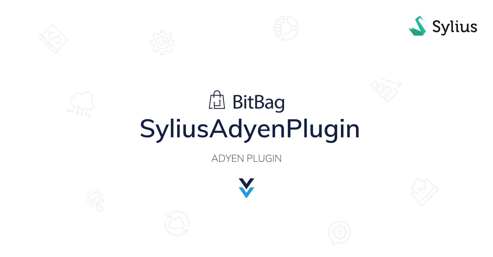
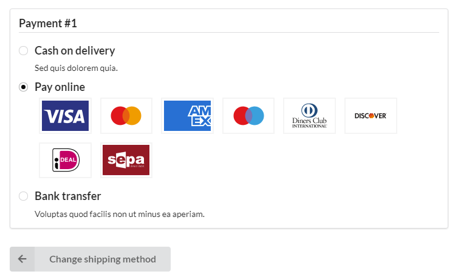

# 

# Adyen Payments Plugin for Sylius
----

[ ](https://packagist.org/packages/bitbag/adyen-plugin "License") [](http://sylius-devs.slack.com) [](https://bitbag.io/contact-us/?utm_source=github&utm_medium=referral&utm_campaign=plugins_adyen)

At BitBag we do believe in open source. However, we are able to do it just because of our awesome clients, who are kind enough to share some parts of our work with the community. Therefore, if you feel like there is a possibility for us working together, feel free to reach us out. You will find out more about our professional services, technologies and contact details at [https://bitbag.io/](https://bitbag.io/?utm_source=github&utm_medium=referral&utm_campaign=plugins_adyen).

## Table of Content

***

* [Overview](#overview)
* [Support](#we-are-here-to-help)
* [Features](#features)
* [Installation](#installation)
    * [Requirements](#requirements)
    * [Customization](#customization)
    * [Configuration](#configuration)
    * [Security](#security)  
    * [Testing](#testing)
    * [Frontend part](#frontend-part)
* [About us](#about-us)
    * [Community](#community)
* [Additional Sylius resources for developers](#additional-resources-for-developers)
* [License](#license)
* [Contact](#contact)

# Overview
----




Adyen is a growing payment processing company. This plug-in is an integration with Sylius, it was developed with Adyen Team cooperation to provide the best experience.
It supports all methods available to [drop-in](https://docs.adyen.com/online-payments/drop-in-web).

# Features

|**Feature Table** | **Support** |
| -------------    | ----------- |
| **Configuration panel** |
| Encrypted authorization | Yes |
| Encrypted notification password | Yes |        
| Encrypted HMAC key | Yes |
| Credential validation | Yes |
| Live/Sandbox environment | Yes |
| Live endpoint URL prefix | Yes |
| **Payments** |
| [Payment dropin](https://docs.adyen.com/online-payments/web-drop-in) | Yes |
| [Card payments](https://docs.adyen.com/payment-methods/cards) | Yes |
| [3D Secure](https://docs.adyen.com/online-payments/3d-secure) | Yes |
| **Wallet payments** |
| [WeChat Pay](https://docs.adyen.com/payment-methods/wechat-pay) | Yes |
| [Apple Pay](https://docs.adyen.com/payment-methods/apple-pay) | Yes |
| [Google Pay](https://docs.adyen.com/payment-methods/google-pay) | Yes |
| [AliPay](https://docs.adyen.com/payment-methods/alipay) | Yes |
| **[One-click payment methods](https://docs.adyen.com/online-payments/classic-integrations/api-integration-ecommerce/recurring-payments/authorise-a-recurring-payment#one-click-payments)** |
| [Klarna](https://docs.adyen.com/payment-methods/klarna) | Yes |
| [Dotpay](https://docs.adyen.com/payment-methods/dotpay#page-introduction) | Yes |
| [Twint](https://docs.adyen.com/payment-methods/twint#page-introduction) | Yes |
| [Blik](https://docs.adyen.com/payment-methods/blik#page-introduction) | Yes |
| [PayPal](https://docs.adyen.com/payment-methods/paypal) | Yes |
| [iDeal](https://docs.adyen.com/payment-methods/ideal) | Yes |
| SEPA | Yes |
| [Sofort](https://docs.adyen.com/payment-methods/sofort#page-introduction) | Yes |
| [Bancontact Card](https://docs.adyen.com/payment-methods/bancontact) | Yes |
| **Order management** |
| [Capture](https://docs.adyen.com/issuing/payment-stages#captures) | Yes |
| [Partial refunds](https://docs.adyen.com/issuing/payment-stages#refunds) | Yes |

If you want to learn more about plugins functionalities, please go under this [link](https://github.com/BitBagCommerce/SyliusAdyenPlugin/blob/master/doc/functionalities.md).

## We are here to help
This **open-source plugin was developed to help the Sylius community** and make Adyen payments platform available to any Sylius store. If you have any additional questions, would like help with installing or configuring the plugin or need any assistance with your Sylius project - let us know!

[](https://bitbag.io/contact-us/?utm_source=github&utm_medium=referral&utm_campaign=plugins_adyen)


# Installation
----

### Requirements

We work on stable, supported and up-to-date versions of packages. We recommend you to do the same.

| Package                | Version        |
|------------------------|----------------|
| PHP                    | ^8.0           |
| ext-json:              | *              |
| sylius/refund-plugin   | ^1.0.0         |
| sylius/resource-bundle | ^1.8           |
| sylius/sylius          | ~1.12 or ~1.13 |
| symfony/messenger      | ^5.4 or ^6.0   |
| adyen/php-api-library  | ^11.0          |

----

### Full installation guide
- [See the full installation guide](doc/installation.md)

## Customization
----
##### You can [decorate](https://symfony.com/doc/current/service_container/service_decoration.html) available services and [extend](https://symfony.com/doc/current/form/create_form_type_extension.html) current forms.

Run the below command to see what Symfony services are shared with this plugin:

```
$ bin/console debug:container bitbag_sylius_adyen_plugin
```

Plug-in heavily relies on Symfony's [Messenger](https://symfony.com/doc/current/messenger.html) Component. All the payment notifications handling actions are done by messages and their handlers. Feel free to play with, decorate or provide a middleware to customize plug-in according to your needs.

All the processing is done using `sylius.command_bus` (`sylius_default.bus` in previous versions). `sylius.event_bus` (`sylius_event.bus`) is used to hook up Refund Plug-in requests and let the Adyen know that refund is requested.

## Configuration
----
The plug-in provides a configuration that can be overrided:

```yaml
bitbag_sylius_adyen:
  logger: ~
  supported_types: ~
```

| property | type | description
| --- | --- | --- |
| logger | null\|string | specifies a logger service name which handles dumping of all traffic between your Sylius instance and Adyen API; useful for debugging. Empty value = disable logging |
| supported_types | null\|array | whitelist of visible payment methods; null = all tested payment methods, array = list of payment types, empty array = don't filter at all and show everything returned by Adyen |

## Security
----

If you find anything that could be a security problem, please reach us first on `hello@bitbag.io` in order to prepare a patch before disclosure.

We know that your money is valuable, so we designed this plug-in to change the payment statuses only at the request of Adyen systems that are signed using HMAC signature.

## Frontend part
----
### Starting and building assets

* Go to `./tests/Application/` directory
* `bin/console assets:install`

### CSS & JS files directory

* CSS: go to `./src/Resources/public/css/**/`
* JS: go to `./src/Resources/public/js/**/`

## Testing
----
```
$ composer install
$ cd tests/Application
$ bin/console assets:install -e test
$ bin/console doctrine:database:create -e test
$ bin/console doctrine:schema:create -e test
$ yarn install
$ yarn encore dev
$ yarn gulp
$ bin/console server:run 127.0.0.1:8080 -e test
$ bin/phpunit
$ bin/behat
```

# About us
---

BitBag is an agency that provides high-quality **eCommerce and Digital Experience software**. Our main area of expertise includes eCommerce consulting and development for B2C, B2B, and Multi-vendor Marketplaces.
The scope of our services related to Sylius includes:
- **Consulting** in the field of strategy development
- Personalized **headless software development**
- **System maintenance and long-term support**
- **Outsourcing**
- **Plugin development**
- **Data migration**

Some numbers regarding Sylius:
* **20+ experts** including consultants, UI/UX designers, Sylius trained front-end and back-end developers,
* **100+ projects** delivered on top of Sylius,
* Clients from  **20+ countries**
* **3+ years** in the Sylius ecosystem.

---

If you need some help with Sylius development, don't be hesitated to contact us directly. You can fill the form on [this site](https://bitbag.io/contact-us/?utm_source=github&utm_medium=referral&utm_campaign=plugins_adyen) or send us an e-mail to hello@bitbag.io!

---

[](https://bitbag.io/contact-us/?utm_source=github&utm_medium=referral&utm_campaign=plugins_adyen)

## Community
----
For online communication, we invite you to chat with us & other users on [Sylius Slack](https://sylius-devs.slack.com/).


## Additional resources for developers
---
To learn more about our contribution workflow and more, we encourage ypu to use the following resources:
* [Sylius Documentation](https://docs.sylius.com/en/latest/)
* [Sylius Contribution Guide](https://docs.sylius.com/en/latest/contributing/)
* [Sylius Online Course](https://sylius.com/online-course/)

## License
---

This plugin's source code is completely free and released under the terms of the MIT license.

[//]: # (These are reference links used in the body of this note and get stripped out when the markdown processor does its job. There is no need to format nicely because it shouldn't be seen.)

## Contact
---
If you want to contact us, the best way is to fill the form on [our website](https://bitbag.io/contact-us/?utm_source=github&utm_medium=referral&utm_campaign=plugins_adyen) or send us an e-mail to hello@bitbag.io with your question(s). We guarantee that we answer as soon as we can!

[](https://bitbag.io/contact-us/?utm_source=github&utm_medium=referral&utm_campaign=plugins_adyen)
