## Configuration

> :warning: **Notice**
>
> When it comes to configuration of Sylius itself: some countries need to contain the *state* or *province* field to properly handle some of the offered payment methods. These can be configured under Configuration > Countries in the Sylius admin panel.

> :warning: **Notice**
> 
> Mind that refunds **from** Adyen do not work. You must refund order items directly from the Sylius admin panel.

> :warning: **Notice**
> 
> The plugin resolves the available payment methods based on the base currency of your shop. This means that when USD is the base currency and the user switches over to EUR and, say, Klarna is constrained to EUR, the payment method will not be visible to the customer. 

1. Obtain an [Adyen](https://adyen.com) account. If you want to test the gateway, [register a test account](https://www.adyen.com/signup/).

2. Head over to the API Credentials page:
   
   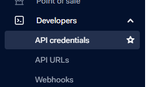
   
3. Choose an existing merchant account or create a new one.

4. Generate an API key + client key (remember to copy them immediately, they're displayed only once):

   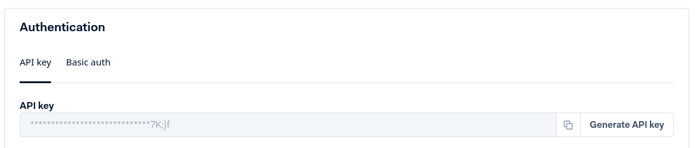
   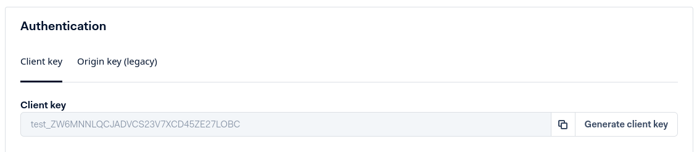
   
5. Add an origin; type your shop URL and save it:
   
   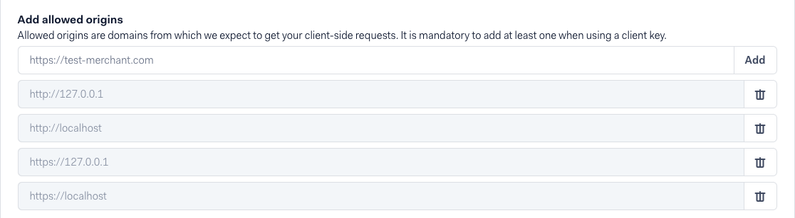

6. Create a new Adyen payment method. Fill in the merchant account, API and client keys obtained in step 4. Also, create a username and password to be used for webhook credentials and choose the correct environment, either `live` or `test`. Don't save yet.

   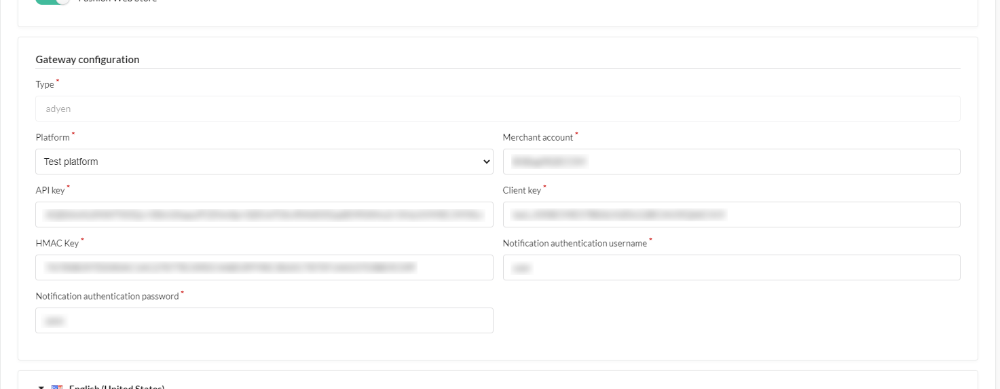

7. Come back to the Adyen panel, create a standard webhook:
   
   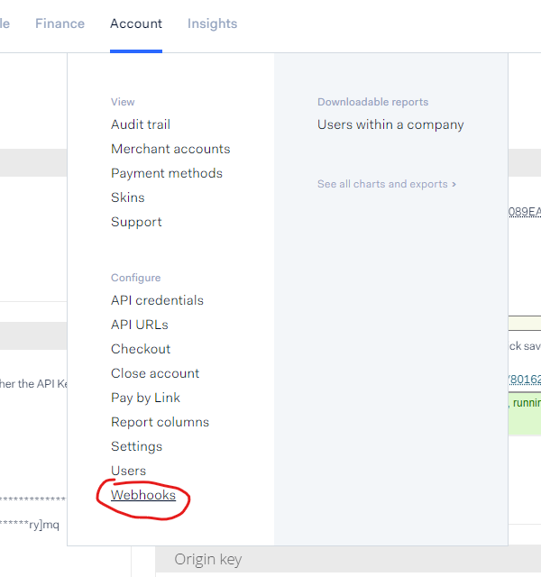
   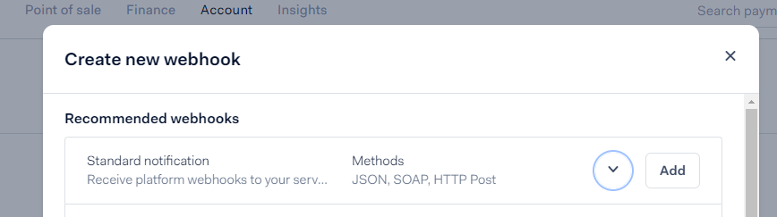

8. Type the username and password obtained in step 6:

   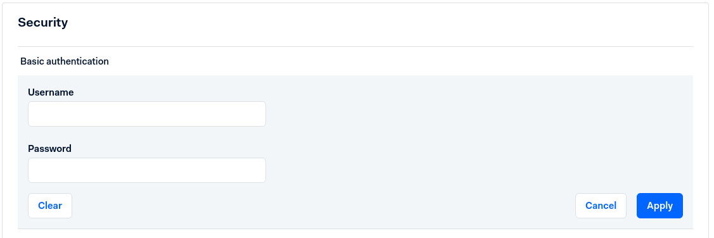

9. Expand the `Additional settings section` and generate an HMAC key:

   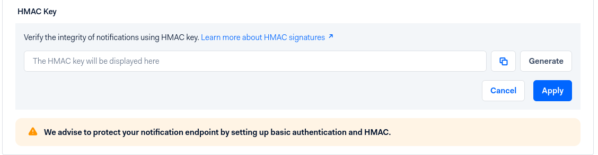

10. Go back to the Sylius payment method configuration and paste the previously generated HMAC key.

11. Save the payment method.

12. Once saved, an additional box will be displayed. Copy the URL and paste it in the Adyen panel. Remember: if you are testing plugin and using tunneling for example: ngrok, remember to change `localhost:port` to `https://example.ngrok-free.app`

   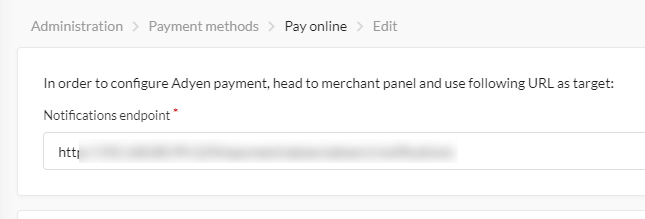
 
13. Now you're ready to save and test the webhooks. If everything goes green, you're done and ready to go.

14. Before going to production you will have to create and set up your api url prefix. In test environment you can type: `prefix`.

   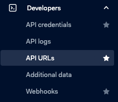
   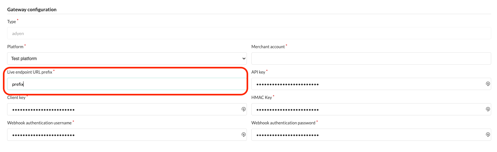
