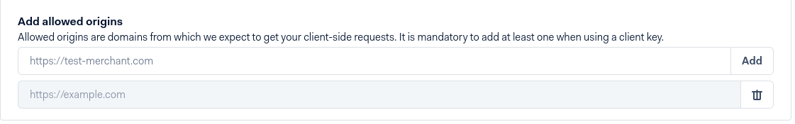

## Configuration

1. Obtain an [Adyen](https://adyen.com) account. If you want to test the gateway, [register a test account](https://www.adyen.com/signup/).

2. Head to API Credentials page:
   
   
   
3. Choose an existing merchant account or create new.

4. Generate an API key + client key:
   
   
   
5. Add an origin; type your shop URL:
   
   

6. Create a new Adyen payment method. Type a merchant account, API and client key obtained in step 4. Also, create a username and password to be used for notifications credentials. Save payment method:

   

   Don't forget to choose a proper environment: `test` or `live`.   

7. Come back to the Adyen panel, create a standard webhook:
   
   
   

8. Type username password created in step 6:

   

9. Expand `Additional settings section` and generate HMAC key:

   

10. Back to the payment method configuration and paste previously generated HMAC key.

11. Save payment method.

12. If you open a payment method again, additional box is being displayed. Copy the URL and paste here in Adyen panel:

   
   
 
13. Now you're ready to save and test the webhook notification. If everything goes green, you're done and ready to go.