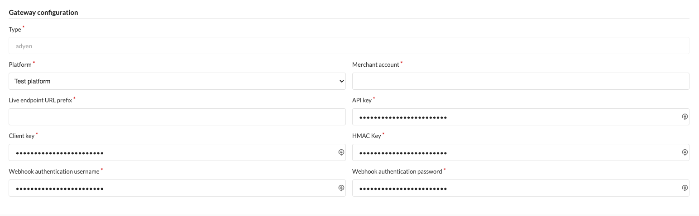
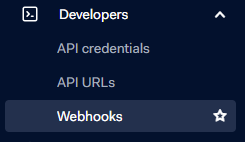

## Configuration

> :warning: **Notice**
>
> When it comes to configuration of Sylius itself: some countries need to contain the *state* or *province* field to properly handle some of the offered payment methods. These can be configured under Configuration > Countries in the Sylius admin panel.

> :warning: **Notice**
> 
> Mind that refunds **from** Adyen do not work. You must refund order items directly from the Sylius admin panel.

> :warning: **Notice**
> 
> The plugin resolves the available payment methods based on the base currency of your shop. This means that when USD is the base currency and the user switches over to EUR and, say, Klarna is constrained to EUR, the payment method will not be visible to the customer. 

1. Obtain an [Adyen](https://adyen.com) account. If you want to test the gateway, [register a test account](https://www.adyen.com/signup/).

2. Head to API Credentials page:
   
   
   
3. Choose an existing merchant account or create new.

4. Generate an API key + client key:
   
   
   
5. Add an origin; type your shop URL and save (keep in mind that you should have already copied the API key, it's displayed only once):
   
   

6. Create a new Adyen payment method. Type a merchant account, API and client key obtained in step 4. Also, create a username and password to be used for notifications credentials and choose correct environment, either `live` or `test`. Don't save yet.

   

7. Come back to the Adyen panel, create a standard webhook:
   
   
   

8. Type username password typed in step 6:

   

9. Expand `Additional settings section` and generate HMAC key:

   

10. Back to the Sylius payment method configuration and paste previously generated HMAC key.

11. Save payment method.

12. Once saved, additional box is being displayed. Copy the URL and paste in Adyen panel:

   
 
13. Now you're ready to save and test the webhook notification. If everything goes green, you're done and ready to go.
