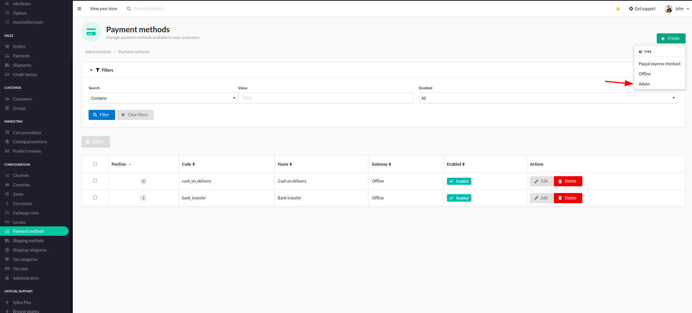
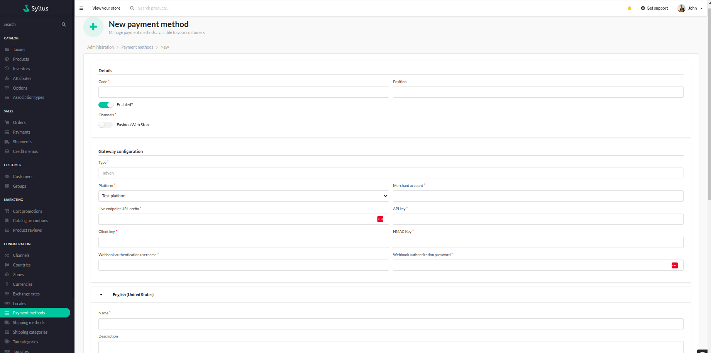

# Functionalities

---
Adyen is a growing payment processing company. This plug-in is an integration with Sylius, it was developed with Adyen Team cooperation to provide the best experience.
With this plugin, user is able to create new payment method for Adyen payments.

>[Adyen payment methods list](https://www.adyen.com/payment-methods)

- Adding a new payment method to Sylius

    

- After choosing this, user is taken to the configuration form where it is required to fill out all the needed info for Adyen payment to work.

    

- Once the method is established, it is now possible to use it in the checkout. 

    

